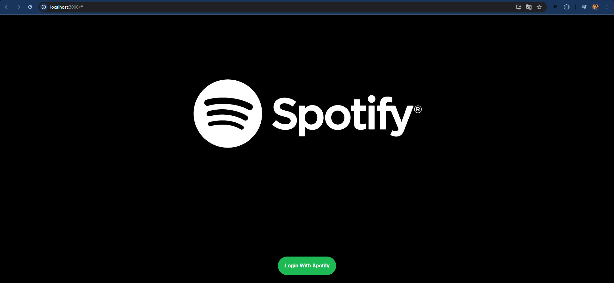
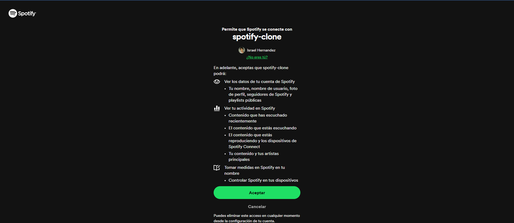
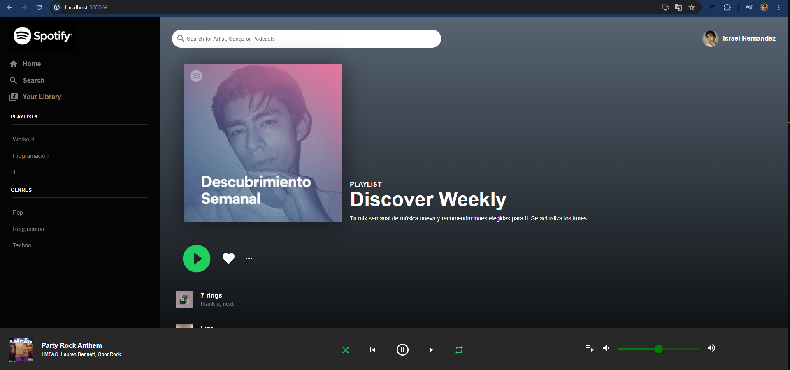
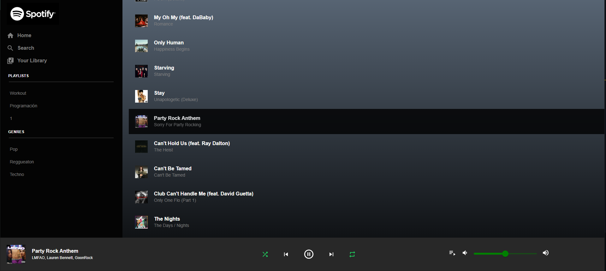

# Spotify Clone

Developed with:
- React JS
- Context API
- Spotify API
- User Authentication
- Material UI

## To run the project

Write your spotify client id in `spotify.js` and execute: 

### `npm start`

Open [http://localhost:3000](http://localhost:3000) to view it in your browser.

## Images:

- Login 

- Login with Spotify

- Home page

- Choosing a song
  

